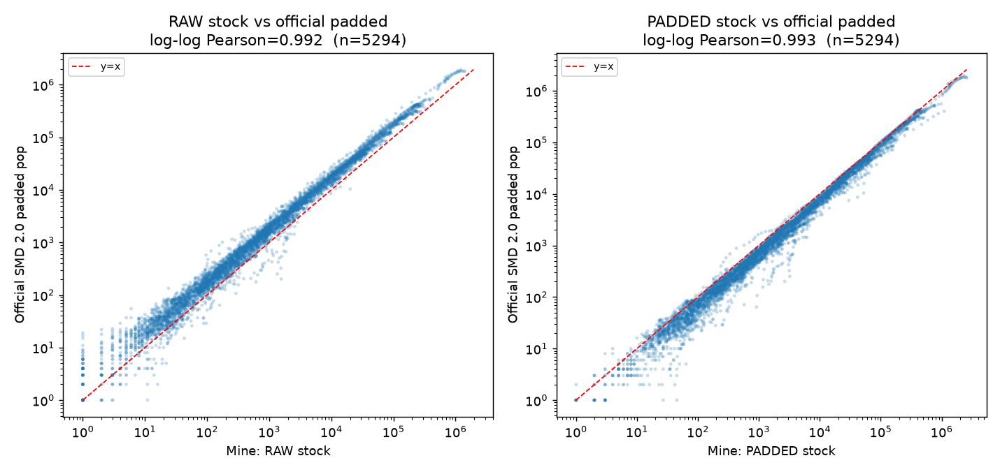
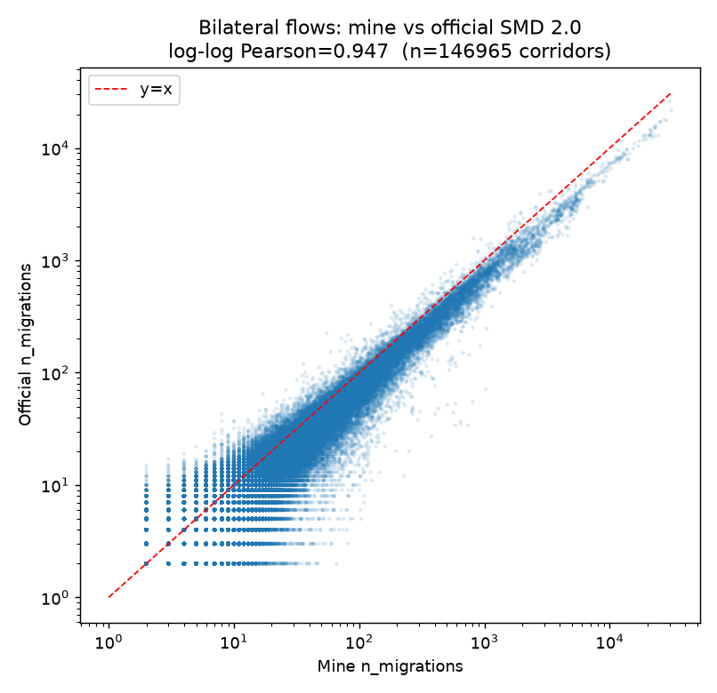

# OpenAlex Scholar Migration Pipeline (1998–2025)

*语言 / Language: [中文](README.md) · **English***

A pipeline that rebuilds international scholar-migration data directly from the full **OpenAlex** `works` snapshot, replicating the methodology of the [Scholarly Migration Database (SMD)](https://www.scholarlymigration.org/data.html). Extraction range: **1998–2025**.

> **Motivation**: In the official SMD 2.0 data, the **bilateral flows (countryflows) only go up to 2022** (the stock table reaches 2024). This pipeline reconstructs the migration data from OpenAlex and extends **both the country-year stock and the bilateral flows to 2025**, validated against the official data.
>
> **Extraction range vs. usable range**: To give migration-event detection a sufficient "warm-up" buffer (aligned with SMD starting in 1998), we extract 1998–2025. **Both ends need caution**:
> - **1998–2002 is a warm-up buffer**: early-year migration is systematically underestimated (in particular the first year 1998 has in/out = 0). Analysis should start from **2003**.
> - **2025 is provisional / right-censored**: the snapshot is from 2026, so 2025 papers are still being ingested and padding lacks future years; stock and migration are both biased low. **Use with caution or drop.**
> - **Robust usable range ≈ 2003–2024.**

---

## Repository layout

```
openalex_pipeline/
├── ssh_run.py              # Tool: drive the remote server (upload/run/fetch); not a pipeline step
├── 01_extract.py           # (1) Extract: per date-partition, count (author_id, year, country)
├── 02_extract_big.py       # (2) Extract (huge partitions): shard by single file
├── 03_migration.py         # (3) Migration-event detection + aggregation (stock/flows/bilateral)
├── 04_padding.py           # (4) Replicate SMD population padding (2-year backward fill)
├── 05_compare_stock.py     # (5) Validation: stock vs. official SMD 2.0
├── 06_compare_flows.py     # (6) Validation: bilateral flows vs. official SMD 2.0
├── 07_top_corridors.py     # (7) Validation: top bilateral corridors, side by side
└── results/                # Output data and figures
    ├── openalex_country_year_1998_2025.csv         # Country-year (raw stock)
    ├── openalex_country_year_padded_1998_2025.csv  # Country-year (padded stock)
    ├── openalex_bilateral_flows_1998_2025.csv      # Bilateral flows
    ├── compare_stock_padding.png                    # Stock consistency scatter
    └── compare_flows.png                            # Bilateral-flow consistency scatter
```

---

## Data sources

- **OpenAlex** public S3 snapshot `s3://openalex/data/parquet/works/` (CC0, free, no credentials required).
- The full `works` parquet is ~**725 GB**, split into 482 date-partitions by `updated_date`.
- Official reference data: SMD 2.0 (Zenodo [10.5281/zenodo.11145734](https://doi.org/10.5281/zenodo.11145734)).

---

## Method (following SMD)

Field names below match the scripts and data exactly. In OpenAlex, each work's author has an `author_id`, a `publication_year`, and a `country` (the country of the author's affiliation).

**Step 1 — Extract (`01_extract.py` / `02_extract_big.py`)**
Read the cloud data directly with DuckDB (only the needed columns; raw data never lands on disk). Explode every author of every work and count "how many times a given author, in a given year, appears in a given country", producing a 4-column table: `author_id, year, country, n` (`n` = count).

**Step 2 — Residence per author-year (`residence` table in `03_migration.py`)**
An author may list several countries in one year. Rule: **the country with the highest count `n` is that year's residence** (ties broken by the larger country code, only for reproducibility). Each author-year keeps one row: `author_id, year, residence`.

**Step 3 — Migration events (`events` table)**
Sort each author's rows by year and compare consecutively: **if this year's residence differs from the previous observed year's, that is one migration event**, recorded as "from the previous country to this year's country", dated to this year.

**Step 4 — Padding the researcher count (`04_padding.py`)**
An author who skips publishing in a year "disappears" that year. Following SMD: **if they publish again within the next 1–2 years, treat them as still present that year**, backfilling with the residence of the next available year, so they still count toward that year's researcher total. This only affects the researcher count, not the events from Step 3.

**Step 5 — Aggregate (export CSV)**
Aggregate by country and year into two outputs:
- Country-year: `n_researchers`, `inmigration`, `outmigration`, `netmigration`, and their rates.
- Bilateral flows: `year, from_country, to_country, n_migrations`.

---

## Execution order

Scripts run in file-prefix order `01→07`. **01–04 run on the remote server** (large RAM and bandwidth to AWS needed); **05–07 run locally** (compare `results/` against the official parquet).

### Remote extraction & aggregation (01–04)

`ssh_run.py` uploads scripts to the server and runs them:

```bash
# upload scripts
python ssh_run.py --put 01_extract.py 02_extract_big.py 03_migration.py 04_padding.py

# run in order (background + resumable recommended; see in-script comments)
# 01 normal-partition extract; 02 huge-partition sharded extract;
# 03 migration detection + aggregation; 04 padding recompute of stock
```

Connection info is provided via environment variables: `OA_HOST / OA_PORT / OA_USER / OA_PASS`.

### Local validation (05–07)

```bash
python 05_compare_stock.py     # stock consistency  -> results/compare_stock_padding.png
python 06_compare_flows.py     # flow consistency   -> results/compare_flows.png
python 07_top_corridors.py     # top corridors, side by side (prints a table)
```

The official SMD path defaults relative to this repo; override with env vars if located elsewhere:
`SMD_COUNTRY_PARQUET` (used by 05), `SMD_DIR` (used by 06/07).

---

## Output fields

### `openalex_country_year_1998_2025.csv` / `..._padded_...csv`
| Field | Meaning |
| --- | --- |
| year | Year (1998–2025) |
| country | ISO2 country code |
| n_researchers / n_researchers_padded | Researcher stock (raw / padded) |
| inmigration / outmigration | In- / out-migrating scholars |
| netmigration | Net migration = in − out |
| inmigration_rate / outmigration_rate / netmigration_rate | Corresponding rates |

### `openalex_bilateral_flows_1998_2025.csv`
| Field | Meaning |
| --- | --- |
| year | Migration-event year |
| from_country / to_country | Origin / destination country (ISO2) |
| n_migrations | Number of migrations in that year and direction |

---

## Consistency check vs. official SMD 2.0

After aligning the slice (gender=all, field=all, overlapping years) with the official SMD 2.0 OpenAlex data:

| Metric | Correlation | Notes |
| --- | --- | --- |
| Bilateral flows `n_migrations` | Pearson **0.990**, log-log **0.947** | 1998–2022 overlap, 146,965 corridors |
| Researcher stock | log-log Pearson **0.99** (both RAW/PADDED) | 1998–2024 overlap, 5,294 points, cross-sectionally very consistent |

- Top 2022 corridors match closely: USA→CHN (official 26073 / here 29997), GBR→USA (11426 / 12461), IND→USA (7421 / 9790), etc.
- **Absolute stock levels** differ systematically from the official padded figure (raw ≈ 58% of official; after 2-year backfill ≈ 137%), because SMD's exact padding is proprietary and unpublished. **Prefer rates / relative measures or normalize**, rather than comparing absolute stocks directly.
- The stock scatter plots only include points where **both** sources are > 0. A few country-years appear in only one source (coverage mismatch between the two datasets, not a value disagreement); including them would distort the log-log correlation.
- In/out counts correlated ~0.98 with the official data in earlier analysis (same slice); this round focuses on bilateral flows and stock.




---

## Dependencies

- Remote (01–04): Python 3 + `duckdb`, `pyarrow`, `awscli`; a large-RAM machine; access to `s3://openalex`.
- Local (05–07): Python 3 + `pandas`, `pyarrow`, `numpy`, `scipy`, `matplotlib`.
- `ssh_run.py` requires `paramiko`.

```bash
pip install duckdb pyarrow awscli pandas numpy scipy matplotlib paramiko
```

---

## Notes & caveats

- **1998 is the baseline year**: migration events rely on "compare with the previous observed year", so each author's first observed year (the global start, 1998) has no event. **1998 in/out/net are all 0**, used only to seed later years' baseline residence.
- **1998–2002 warm-up buffer**: too few authors are yet in the corpus, so migration is systematically underestimated; start analysis from **2003**.
- **2025 is censored**: the snapshot is from 2026, so 2025 papers are incomplete and padding lacks future years; stock and migration are biased low. Marked provisional — **use with caution or drop**. Robust usable range ≈ **2003–2024**.
- **OpenAlex vs. Scopus**: OpenAlex has broader coverage of non-Western countries and preprints (hence CN/ID/IN rank high) but noisier author disambiguation than Scopus. Treat this data as an **extension / robustness check** for SMD (Scopus).

---

## Citation

Please cite both OpenAlex and the Scholarly Migration Database:

- OpenAlex: Priem, Piwowar, Orr (2022). *OpenAlex: A fully-open index of scholarly works.* arXiv:2205.01833.
- SMD: Akbaritabar, Theile, Zagheni (2024). *Bilateral flows and rates of international migration of scholars.* Scientific Data. [10.1038/s41597-024-03655-9](https://doi.org/10.1038/s41597-024-03655-9)
